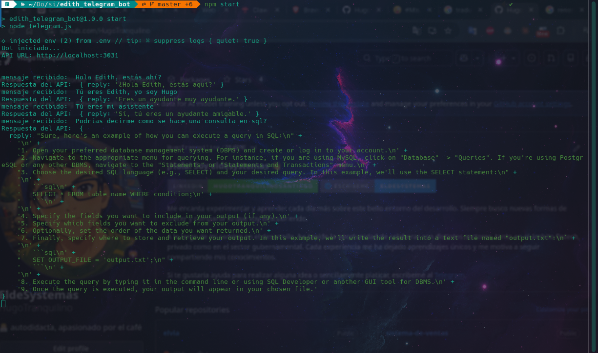

# 🤖 Edith Telegram Bot

Bot de Telegram conectado a una API local que procesa mensajes y responde automáticamente.

---

## 🚀 Características

* Recibe mensajes desde Telegram
* Envía prompts a una API (`/chat`)
* Responde en tiempo real
* Integración sencilla con edith-core (un pequeño backend que se conecta con ollama utilizando el agente tinyllama)

---

## 📦 Requisitos

* Node.js v18+
* npm o yarn
* Una API corriendo (por defecto en `http://localhost:3031`)

---

## ⚙️ Instalación

Clona el repositorio:

```bash
git clone <repo-url>
cd edith_telegram_bot
```

Instala dependencias:

```bash
npm install
```

---

## 🔐 Variables de entorno

Crea un archivo `.env` basado en `.env.example`:

```env
BOT_TOKEN=tu_token_de_telegram
API_URL=http://localhost:3000
```
> ⚠️ No subas tu archivo `.env` al repositorio.

---

## ▶️ Ejecución

```bash
npm start
```

---

## 🔌 API esperada

El bot espera que tu backend tenga este endpoint:

### POST `/chat`

#### Request:

```json
{
  "prompt": "Hola"
}
```

#### Response:

```json
{
  "reply": "Hola 👋"
}
```

---

## 🧪 Pruebas rápidas

Verifica que tu API esté activa:

```bash
curl http://localhost:3031
```

Probar endpoint:

```bash
curl -X POST http://localhost:3031/chat \
  -H "Content-Type: application/json" \
  -d '{"prompt":"hola"}'
```

---

## 🛠️ Tecnologías

* node-telegram-bot-api
* axios
* dotenv

---

## 🔒 Seguridad

* Nunca expongas tu `BOT_TOKEN`
* Usa `.env` para manejar secretos
* Si el token se filtra, revócalo con BotFather

---

## 📌 TODO

* [ ] Manejo de errores más robusto
* [ ] Logs estructurados
* [ ] Deploy en servidor/VPS
* [ ] Soporte para mas comandos, para hacerlo mas amigable

---
## 📸 Demo



---

## 👨‍💻 

Proyecto personal para integrar mi bot con IA local (asistente personal)

Telegram → Edith-telegram-bot → Edith-core → (tools o IA) → respuesta
